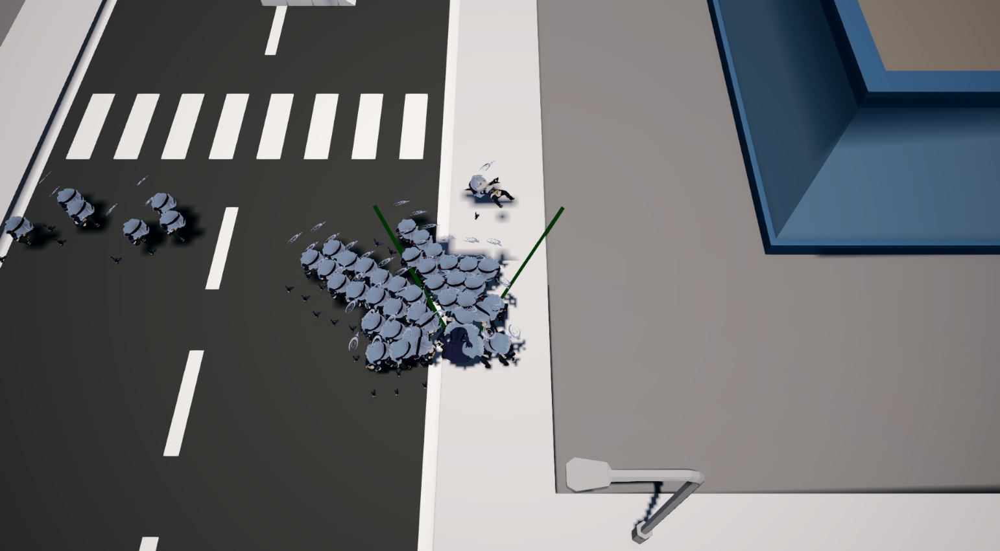

# LogueLikeProject
제가 그렇게 좋아하는 유우카와 함께 하는 어딘가 정신 나간 로그라이크 게임입니다.

### 도망치고 맞서 싸워라 !!



# 기술
## 계단 오르기


말 그대로 계단형 지형을 오르는 로직을 적용했습니다.

raycast 두 번만으로 계단 지형을 판정하는 로직을 만들었습니다.


```csharp
 /// <summary>
    /// 계단을 올라가는 로직
    /// </summary>
    /// <param name="delta">다음 이동 델타</param>
    /// <returns>다음 계단 위치로 가기 위한 delta벡터를 반환합니다. 계단이 아니라면 영벡터를 반환함.</returns>
    private Vector3 StairStepUp(Vector3 delta){
        Vector3 stepUp = Vector3.zero;
        Vector3 direction = delta.normalized;

        Vector3 stepcheck = 
            _rigidbody.position + delta + 
            Vector3.up * maxStepHeight + 
            direction * stepCheckDistance;

        /*

                           pos
                     [     ** ------>|Ray   |-----           플레이어 진행방향으로 Ray를 쏘는데, 이때 max step height만큼 높은 위치에서 쏜다.
               max   [     **        |      |                ray가 충돌하지 않는 다는 것은 계단 형태로 인해 음푹 들어가서 발 디딜곳이 존재한다는 것이다.
              step   [     **  |-----v------|                반대로 충돌한다면 이는 벽이거나, 계단이여도 계단의 경사가 너무 가파르다는 것이다.
            height   [     **  |    Ray2                     
                    ==============================            만약 ray가 충돌 하지 않아 계단임이 확인 되었다면 이번엔 아랫방향으로 ray를 쏜다.
                                                              ray가 충돌 했을 때 평평한 면(Vector3.up)이면 우리가 생각하는 계단이므로 다음 위치치 y값을 반환하는 형태이다.
                                                              다만 이건 내가 "계단은 무조건 90도여야 한다"라는 규정을 내렸기 때문에 가능한거고
                                                              평탄하지 않은 계단 설정이 있다면(이를테면 조금 높은 바위 언덕) 이라면 좀 더 다양한 로직이 필요할 것.
        */

        Ray ray = new Ray(_rigidbody.position + delta + Vector3.up * maxStepHeight, direction);

        
        Debug.DrawRay(_rigidbody.position + delta + Vector3.up * maxStepHeight, direction * stepCheckDistance, Color.green, 5);
        Debug.DrawRay(stepcheck, Vector3.down * maxStepHeight, Color.cyan, 5);

        if(!Physics.Raycast(ray, stepCheckDistance)){
            Ray ray2 = new Ray(stepcheck, Vector3.down);
            
            if(Physics.Raycast(ray2, out RaycastHit hit, maxStepHeight)){
                if(hit.normal == Vector3.up){
                    print("stair");
                    stepUp = new Vector3(0, hit.point.y - _rigidbody.position.y, 0);
                }
            }
        }
        return stepUp;
    }

```
로직의 작동 원리에 대해 더 자세히 보고 싶으면 기록된 [노션 링크](https://glaze-culotte-b91.notion.site/1befbd73ff3f807489e8d6d3a3deb97c)를 참고해주세요


## 스킬 시스템

직접 스킬시스템을 설계하고 구현했습니다.


## batch 및 fps 개선

굉장히 많은 적 오브젝트가 쏟아져 나오는 게임인 만큼, 최적화가 중요합니다.

적 몬스터의 batches를 줄이기 위해 여러 방법을 사용했습니다.


- 씬 안에 100마리의 몬스터가 보인다고 가정.

### 1. 초기 상태

### 2. Mesh baking + Texture Baking
    - 빌드 전 성능<br>
    batches : 평균 2600 →  910정도 (65%감소)<br>
    Fps : 평균 40 → 70fps (75%증가)

    - 빌드 후 성능<br>
    Fps : 평균 90 → 160정도 (78%증가)

더 자세한 내용은 [노션 링크](https://glaze-culotte-b91.notion.site/228fbd73ff3f8093b259f4a5483a3ab1?pvs=74)를 참고해주세요